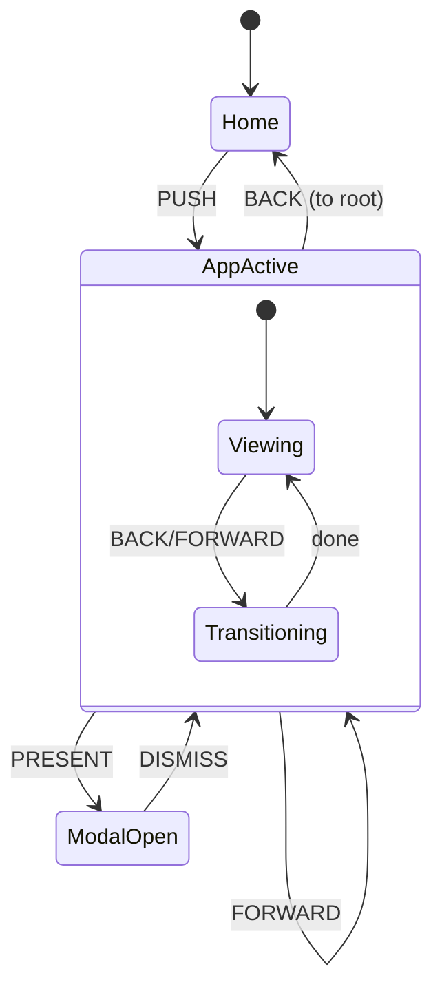

# XState Navigation System

## Architecture Overview



## Per-App Header Design

Each app window has its own header with navigation controls:

```
┌─────────────────────────────────────────────────────────────┐
│  ← Back   → Forward              Title                   ✕  │
├─────────────────────────────────────────────────────────────┤
│                                                             │
│                      App Content                            │
│                                                             │
└─────────────────────────────────────────────────────────────┘
```

- **← Back**: Disabled when at start of history, goes to previous view
- **→ Forward**: Disabled when at end of history, goes to next view (after going back)
- **Title**: Current app/view name (e.g., "Files", "settings.json", "Coder")
- **✕ Close**: Closes entire app stack, returns to home

## State Machine Design

### Navigation Machine (Core)

- **Context**:
  - `backStack: AppRef[]` - History of visited views (for back)
  - `forwardStack: AppRef[]` - Future views (for forward after back)
  - `current: AppRef | null` - Currently active window
  - `modalStack: ModalRef[]` - Modal overlay stack
- **Events**: `PUSH`, `BACK`, `FORWARD`, `CLOSE`, `PRESENT`, `DISMISS`
- **Guards**: `canGoBack`, `canGoForward`, `canDismiss`

### Window Types

- **Stack windows**: `files-app`, `coder-app`, `commands-app`, `image-viewer-app` (push/back/forward)
- **Modal windows**: `clock-modal`, `settings-app`, `launchpad-view` (present/dismiss overlay)

## Key Files

### New Files

- `src/machines/navigation-machine.js` - Core XState navigation machine
- `src/services/navigation-service.js` - Singleton service wrapping XState actor
- `src/components/app-header.js` - Reusable header with Back/Forward/Close/Title
- `src/components/styles/app-header.css` - Header styling
- `src/styles/transitions.css` - Push/pop/modal animations

### Modified Files

- `src/services/app-context.js` - Integrate with XState (or replace)
- `src/components/files-app.js` - Use navigation service + app-header
- `src/components/coder-app.js` - Use navigation service + app-header
- `src/components/clock-modal.js` - Convert to modal presentation
- `src/components/settings-app.js` - Convert to modal presentation
- `src/components/launchpad-view.js` - Convert to modal presentation
- `src/app.js` - Initialize navigation service

## Navigation Machine Definition

```javascript
// src/machines/navigation-machine.js
import { createMachine, assign } from 'xstate';

export const navigationMachine = createMachine({
  id: 'navigation',
  initial: 'home',
  context: {
    backStack: [],       // History for back navigation
    forwardStack: [],    // Future for forward navigation (cleared on new push)
    current: null,       // { id: 'files', title: 'Files', state: {} }
    modalStack: [],      // Modals presented over current view
  },
  states: {
    home: {
      on: {
        PUSH: { target: 'transitioning', actions: 'preparePush' },
        PRESENT: { target: 'presenting' },
      }
    },
    active: {
      on: {
        PUSH: { target: 'transitioning', actions: 'preparePush' },
        BACK: { target: 'transitioning', actions: 'prepareBack', guard: 'canGoBack' },
        FORWARD: { target: 'transitioning', actions: 'prepareForward', guard: 'canGoForward' },
        CLOSE: { target: 'closing' },
        PRESENT: { target: 'presenting' },
      }
    },
    transitioning: {
      entry: 'applyTransition',
      after: { 250: 'active' }
    },
    closing: {
      entry: 'clearStacks',
      after: { 200: 'home' }
    },
    presenting: {
      entry: 'pushModal',
      after: { 250: 'modalActive' }
    },
    modalActive: {
      on: {
        DISMISS: 'dismissing',
        PRESENT: 'presenting',
      }
    },
    dismissing: {
      entry: 'popModal',
      after: { 250: [
        { target: 'modalActive', guard: 'hasModals' },
        { target: 'active', guard: 'hasCurrent' },
        { target: 'home' }
      ]}
    }
  }
}, {
  guards: {
    canGoBack: ({ context }) => context.backStack.length > 0,
    canGoForward: ({ context }) => context.forwardStack.length > 0,
    hasModals: ({ context }) => context.modalStack.length > 0,
    hasCurrent: ({ context }) => context.current !== null,
  },
  actions: {
    preparePush: assign(({ context, event }) => ({
      backStack: context.current 
        ? [...context.backStack, context.current]
        : context.backStack,
      forwardStack: [],  // Clear forward on new push
      current: event.window,
    })),
    prepareBack: assign(({ context }) => {
      const prev = context.backStack[context.backStack.length - 1];
      return {
        backStack: context.backStack.slice(0, -1),
        forwardStack: [context.current, ...context.forwardStack],
        current: prev,
      };
    }),
    prepareForward: assign(({ context }) => {
      const next = context.forwardStack[0];
      return {
        backStack: [...context.backStack, context.current],
        forwardStack: context.forwardStack.slice(1),
        current: next,
      };
    }),
    clearStacks: assign({
      backStack: [],
      forwardStack: [],
      current: null,
    }),
    pushModal: assign(({ context, event }) => ({
      modalStack: [...context.modalStack, event.modal],
    })),
    popModal: assign(({ context }) => ({
      modalStack: context.modalStack.slice(0, -1),
    })),
  }
});
```

## App Header Component

```javascript
// src/components/app-header.js
// Reusable header for all stack-based apps

export class AppHeader extends HTMLElement {
  // Props: title, canBack, canForward
  // Events: 'back', 'forward', 'close'
  
  connectedCallback() {
    this.innerHTML = `
      <div class="app-header">
        <div class="nav-buttons">
          <button class="back-btn" ${!this.canBack ? 'disabled' : ''}>
            <svg>←</svg>
          </button>
          <button class="forward-btn" ${!this.canForward ? 'disabled' : ''}>
            <svg>→</svg>
          </button>
        </div>
        <span class="title">${this.title}</span>
        <button class="close-btn">✕</button>
      </div>
    `;
  }
}
```

## Navigation Behaviors

- **Push**: New view slides in, current moves to backStack, forwardStack cleared
- **Back**: Current moves to forwardStack, previous from backStack becomes current
- **Forward**: Current moves to backStack, next from forwardStack becomes current
- **Close**: Clear all stacks, return to home
- **Present modal**: Overlay slides up over current view
- **Dismiss modal**: Overlay slides down, reveals view below

## Migration Strategy

1. **Phase 1**: Install XState, create navigation machine and service
2. **Phase 2**: Create reusable `app-header` component
3. **Phase 3**: Update launchpad to use `navigationService.push()`
4. **Phase 4**: Migrate files-app to use navigation + app-header
5. **Phase 5**: Migrate coder-app, image-viewer, commands-app
6. **Phase 6**: Convert clock-modal, settings-app to modal presentation
7. **Phase 7**: Add CSS transitions, polish animations. 
8. **Phase 8**: Remove legacy open/close methods